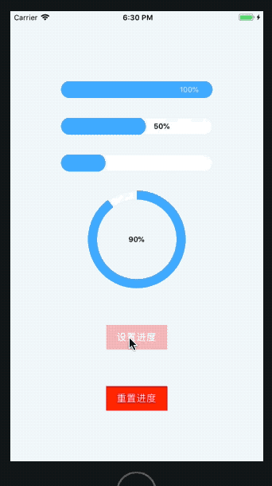

# react-native-sf-progress


# 长条和圆形进度条





# 安装
npm install react-native-sf-progress

# Props (公共)
|  parameter  |  type  |  required  |   description  |  default  |
|:-----|:-----|:-----|:-----|:-----|
|containerStyle|object|no|内容样式，位置设置|null|
|trackTintColor|string|no|进度条背景颜色|'white'|
|progressTintColor|string|no|进度条颜色|'rgba(64,169,255,1)'|
|progress|number|no|进度条进度(0.0-1.0)|0|
|edgeInside|number|no|进度条边距|0|
|borderWidth|number|no|进度条边框宽度|0|
|borderColor|string|no|进度条边框颜色|'rgba(233,233,233,1)'|
|textComponent|bool、func|no|是否显示进度文本（或者写入组件自定义）|true|
|textColor|string|no|进度文字颜色|'black'|
|textFontSize|number|no|进度文字大小|null|
|textFontWeight|string|no|进度文字厚度|'bold'|


# Props (SFProgressBar)
|  parameter  |  type  |  required  |   description  |  default  |
|:-----|:-----|:-----|:-----|:-----|
|width|number|yes|进度条宽度|null|
|height|number|yes|进度条高度|null|
|textWidth|number|no|进度文字宽度|50|
|textLightColor|string|no|进度文字在左边时的颜色|0|


# Props (SFProgressCircle)
|  parameter  |  type  |  required  |   description  |  default  |
|:-----|:-----|:-----|:-----|:-----|
|radius|number|yes|进度条半径|null|
|thickness|number|no|进度条宽度|1|


# Methods（公共）
|  Methods  |  Params  |  Param Types  |   description  |  Example  |
|:-----|:-----|:-----|:-----|:-----|
|setProgress|progress|(float,bool)|设置进度（可带动画和不带动画）||
|getProgress|null|null|获取进度||


# 例子
```

import React, {Component} from 'react';
import {
    Platform,
    StyleSheet,
    Text,
    View,
    TouchableOpacity
} from 'react-native';

import {SFProgressBar,SFProgressCircle} from "react-native-sf-progress"

export default class App extends Component {
    constructor(props) {
        super(props);
        this.state = {

        }
    }

    componentDidMount() {

    }
    click = () => {
        this.refs.pro1.setProgress(1.0)
        this.refs.pro2.setProgress(0.5)
        this.refs.pro3.setProgress(0.2)
        this.refs.pro4.setProgress(0.9)
    }
    clickReset = () => {
        this.refs.pro1.setProgress(0)
        this.refs.pro2.setProgress(0)
        this.refs.pro3.setProgress(0)
        this.refs.pro4.setProgress(0)
    }
    render() {

        return (
            <View style={styles.container}>
                <SFProgressBar
                    containerStyle={{
                        marginTop:30
                    }}
                    ref={"pro1"}
                    width={250}
                    height={30}
                    progress={0.0}
                    borderWidth={1}
                    borderColor={'rgba(233,233,233,1)'}
                    textWidth={80}
                    textComponent={(value,direction)=>{
                        return(
                            <Text style={{
                                color:direction=='right'?'black':'white',
                                fontSize:12,
                            }}>{parseInt(value*100)+'%'}</Text>
                        )

                    }}
                />

                <SFProgressBar
                    containerStyle={{
                        marginTop:30
                    }}
                    ref={"pro2"}
                    width={250}
                    height={30}
                    progress={0.0}
                    borderWidth={1}
                    borderColor={'rgba(233,233,233,1)'}

                />
                <SFProgressBar
                    containerStyle={{
                        marginTop:30
                    }}
                    ref={"pro3"}
                    width={250}
                    height={30}
                    progress={0.0}
                    borderWidth={1}
                    textComponent={false}
                    borderColor={'rgba(233,233,233,1)'}

                />

                <SFProgressCircle
                    containerStyle={{
                        marginTop:30
                    }}
                    ref={"pro4"}
                    radius={80}
                    thickness={15}
                    progress={0.2}
                    borderWidth={1}
                    borderColor={'rgba(64,169,255,0.2)'}

                />

                <TouchableOpacity onPress = {this.click}>
                    <View style={{
                        width:100,
                        height:40,
                        marginTop:60,
                        backgroundColor:'red',
                        alignItems:'center',
                        justifyContent:'center'
                    }}>
                        <Text style={{
                            fontSize:16,
                            color:'white'
                        }}>设置进度</Text>
                    </View>
                </TouchableOpacity>

                <TouchableOpacity onPress = {this.clickReset}>
                    <View style={{
                        width:100,
                        height:40,
                        marginTop:60,
                        backgroundColor:'red',
                        alignItems:'center',
                        justifyContent:'center'
                    }}>
                        <Text style={{
                            fontSize:16,
                            color:'white'
                        }}>重置进度</Text>
                    </View>
                </TouchableOpacity>
            </View>
        );
    }
}

const styles = StyleSheet.create({
    container: {
        flex: 1,
        justifyContent: 'center',
        alignItems: 'center',
        backgroundColor: '#F5FCFF',
    },
    welcome: {
        fontSize: 20,
        textAlign: 'center',
        margin: 10,
    },
    instructions: {
        textAlign: 'center',
        color: '#333333',
        marginBottom: 5,
    },
});

```